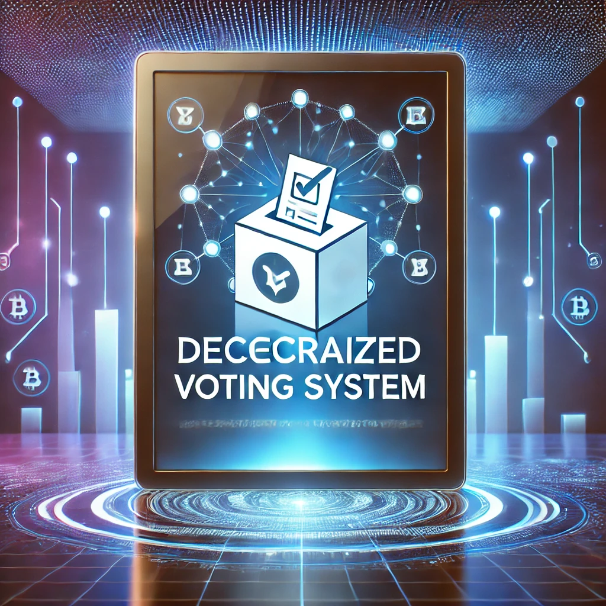

<a name="readme-top"></a>

<div align="center">

  
  <br/>

  <h3><b> DECENTRALIZED VOTING SYSTEM</b></h3>

</div>

<!-- TABLE OF CONTENTS -->

# 📗 Table of Contents

- [📖 About the Project](#about-project)
  - [🛠 Built With](#built-with)
    - [Tech Stack](#tech-stack)
    - [Key Features](#key-features)
- [💻 Getting Started](#getting-started)
  - [Prerequisites](#prerequisites)
  - [Setup](#setup)
  - [Install](#install)
  - [Usage](#usage)
  - [Run tests](#run-tests)
- [👥 Authors](#authors)
- [🔭 Future Features](#future-features)
- [🤝 Contributing](#contributing)
- [⭐️ Show your support](#support)
- [🙏 Acknowledgements](#acknowledgements)
- [📝 License](#license)

<!-- PROJECT DESCRIPTION -->

# 📖  Decentralized Voting System 🗳️  <a name="about-project"></a>
A blockchain-based voting system that enables:  
- Secure proposal creation  
- Delegated voting rights  
- Tamper-proof vote recording  
- Transparent result calculation  

## 🛠 Built With <a name="built-with"></a>

### Tech Stack ⚙️ <a name="tech-stack"></a>

  <ul>
    <li><a href="https://book.getfoundry.sh/">Foundry</a></li>
    <li><a href="https://soliditylang.org/">Solidity</a></li>
    <li><a href="https://ethereum.org/en/developers/docs/evm/">EVM</a></li>
  </ul>
<p align="right">(<a href="#readme-top">back to top</a>)</p>


<!-- Features -->

### Key Features  ✨   <a name="key-features"></a>

✅ **Chairperson-controlled voter registration**  
✅ **Vote delegation to trusted parties**  
✅ **Automatic tie detection between proposals**  
✅ **Fully auditable voting history**  
✅ **Gas-efficient operations**
<p align="right">(<a href="#readme-top">back to top</a>)</p>


<!-- GETTING STARTED -->

## 💻 Getting Started <a name="getting-started"></a>

To get a local copy up and running, follow these steps.

### Prerequisites

In order to run this project you need to install the following items:

- Foundry
- Solidity extension

### Install

Install this project by using:

```
git clone https://github.com/rbd3/Voting-Contract.git
cd Voting-Contract
forge install
```

### Run tests

To run tests, run the following command:


```
forge test
```

<p align="right">(<a href="#readme-top">back to top</a>)</p>

<!-- AUTHORS -->

## 👥 Authors <a name="authors"></a>

👤 **Andry Narson**

- GitHub: [@rbd3](https://github.com/rbd3)
- LinkedIn: [@Andry Narson](https://linkedin.com/in/andry-rabedesana)


<p align="right">(<a href="#readme-top">back to top</a>)</p>

<!-- FUTURE FEATURES -->
## 🔭 Future Features <a name="future-features"></a>
Potential upgrades to expand the voting system's capabilities:

🌐 Build a frontend interface to:

- Visualize real-time vote counts

- Track delegation chains

- Display proposal details and winner history


⛓️ Support cross-chain voting via:

- Layer 2 solutions (Polygon, Arbitrum) for gas efficiency

- Bridge contracts for inter-chain vote aggregation


🤝 Advanced Delegation:

- Time-limited delegation (expiring votes)

- Proposal-specific delegation (delegate power per topic)


🕵️♂️ Anonymous Voting:

- Zero-knowledge proof verification

- Tally contracts to hide individual votes until reveal

<p align="right">(<a href="#readme-top">back to top</a>)</p>
<!-- CONTRIBUTING -->

## 🤝 Contributing <a name="contributing"></a>

Contributions, issues, and feature requests are welcome!

Feel free to check the [issues page](https://github.com/rbd3/Voting-Contract/issues/).

<p align="right">(<a href="#readme-top">back to top</a>)</p>

<!-- SUPPORT -->

## ⭐️ Show your support <a name="support"></a>

Give a star⭐️ or a thumbs up 👍 if you like this project! You can visit my GitHub profile for more of my projects.
[link](https://github.com/rbd3)

<p align="right">(<a href="#readme-top">back to top</a>)</p>

<!-- ACKNOWLEDGEMENTS -->

## 🙏 Acknowledgments <a name="acknowledgements"></a>

- My family who supported me
- Patrick Collins who teach me

<p align="right">(<a href="#readme-top">back to top</a>)</p>

<!-- LICENSE -->

## 📝 License <a name="license"></a>

This project is [MIT](./LICENSE) licensed.

<p align="right">(<a href="#readme-top">back to top</a>)</p>
